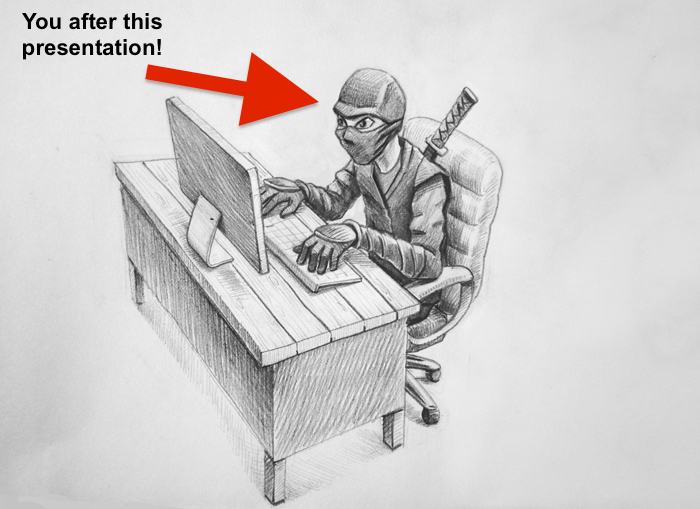

# Allen-Institute-Ninja-Coding
How to become a bonafide Allen Institute Coding Ninja

# [About Me](images/purity.png)

- Noob Mathematician pretending to be a Neuroscientist for now and loving it :)

# Links

[Retinotopic Mapping documentation](
http://retinotopic-mapping.readthedocs.io/en/latest/) - If you want to check
out our package more in depth!

[Numpy Documentation Standards](
https://github.com/numpy/numpy/blob/master/doc/HOWTO_DOCUMENT.rst.txt) -
Use this to learn how to write consistent documentation
that python users can understand!

[Sphinx](http://www.sphinx-doc.org/en/stable/index.html) - BLACK MAGIC!
Use this to automatically generate html websites for your documentation!!! 
A must learn if you want to share your work with a larger audience.

[raspberry pi tutorial](http://makezine.com/projects/build-a-compact-4-node-raspberry-pi-cluster/) -
If you want to build your own raspberry pi cluster for fun, this is the tutorial I followed.